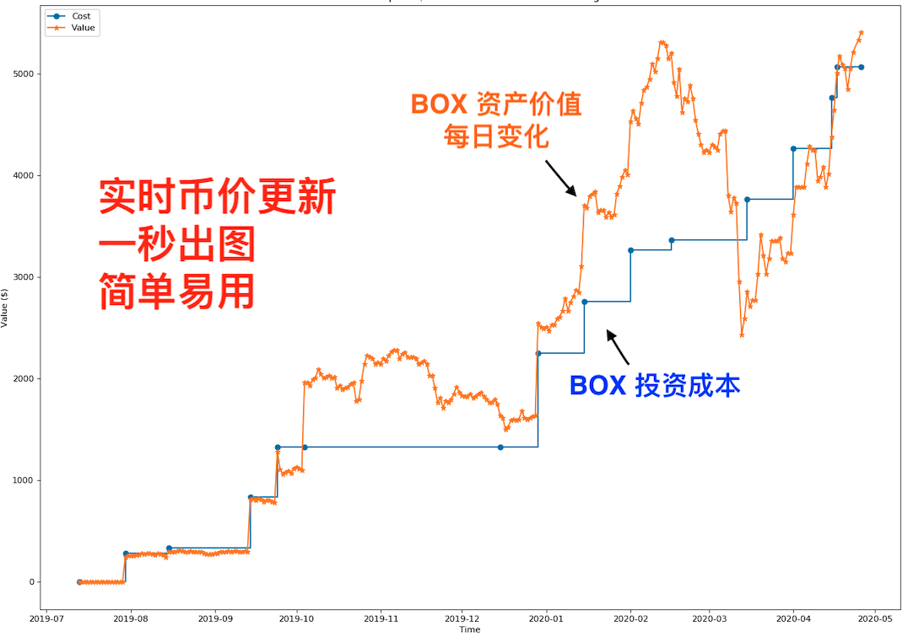

# 虎翼-投资可视化 
## Visualize your regular investments

**1秒生成属于你自己的数字资产投资可视化图表， 见证你的财富升级。**

* V2.0支持五百余币种， 实时币价更新
* python制作，全部代码开源， 安全可信
* 简单易用，1秒出图，无需编程知识
* 支持mac 和 pc
* 免费提供未来软件更新
* 免费提供售后服务两个大周期
* 可以探讨帮助解答python编程问题， 一起学编程

希望这套程序能为你带来方便，节省时间。

版本会不断更新有更多更好的功能。 

记录你的每次投资，可视化你的财富的升级。



>微信公众号：老虎做投资
>
> 微博：虎翼_投资图表可视
>
>飞帖阅读站: [我的文章](https://read.firesbox.com/posts/23b411ab7cf4ab2e6974cf7e2030e1ad225c9132d8f7c74b48ae35e7de81613f)

